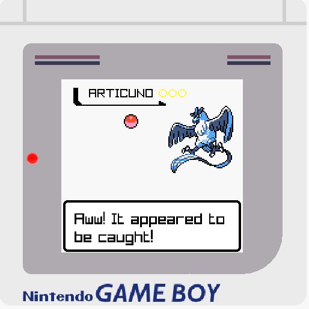

# PokéStroke

**Catch Pokémon while you work. Every keystroke matters.**

Keydex is a lightweight desktop **overlay game** that lives on top of whatever you’re doing.  
As you type, Pokémon spawn. As you keep working, Poké Balls fly.  
Type faster → play faster → catch them all.

Turn everyday work into a passive, motivating mini-game.

## ✨ What is PokéStroke?

PokeStroke is a **keystroke-driven Pokémon catching game** designed to run as an overlay while you work, code, write, or study.

- The game **advances one frame per keystroke**
- Pokémon **spawn progressively** as you type
- Poké Balls are thrown **randomly**
- With enough luck… you might get a **Master Ball**
- Pokémon can **escape**, including legendaries 🥲
- Covers **Generation I & II**

You don’t stop working to play — **working _is_ playing**.

## 🎮 How the Game Works

- Every **key press advances the game**
- Pokémon appear randomly over time
- When a Poké Ball is thrown:
  - Catch probability depends on:
    - Pokémon rarity (_TBD_)
    - Ball type (Poké Ball, Great Ball, Ultra Ball, Master Ball)
- Legendary Pokémon are rare, powerful, and hard to catch (_TBD_)
- The faster and more consistently you type, the faster the world progresses

There is **no active input** beyond typing — the game rewards flow and focus.

## 🌈 Pokémon Variants

Not all Pokémon are the same. Every encounter may surprise you.

Keydex features **three Pokémon variants**, and **you must catch them all**:

### 🔹 Regular

- The standard Pokémon
- Nothing special… until you need them to complete everything

### ✨ Shiny

- **1% chance** to appear
- Rare, flashy, and highly desirable
- A true reward for persistent typing

### ⚫⚪ Black & White

- **0.5% chance** to appear
- No colors, no mercy
- The **hardest variant to catch**
- Only the most dedicated trainers will complete these

Completing your collection means capturing **every Pokémon, in every variant** — including legendaries.

Good luck. You’ll need it.

## 🖼️ Screenshots

> _Coming soon_

## 🗺️ Roadmap

Planned improvements and features:

- [ ] Move window with `Cmd + Mouse drag` like Control
- [ ] Force window not to minimize (true overlay mode)
- [ ] Pokédex (caught, seen, missing)
- [ ] Render number of keystrokes pressed

## 🛠️ Built With

This project is built using [**raylib**](https://www.raylib.com/index.html), a simple and fast C library for graphics, input, and window management.

## 🎯 Design Goals

- **Zero friction** – no context switching
- **Always-on motivation**
- **Minimal UI**
- **Fun without distraction**
- **Feels alive while you work**

## ⚠️ Disclaimer

This is a **fan-made, non-commercial project** created for fun and experimentation.  
All Pokémon-related concepts belong to their respective owners.

## 🚀 Why PokéStroke?

Because:

- Productivity doesn’t have to be boring
- Progress feels better when it’s visible
- And catching a legendary Pokémon while finishing a task just hits different

**Gotta type ’em all.**
